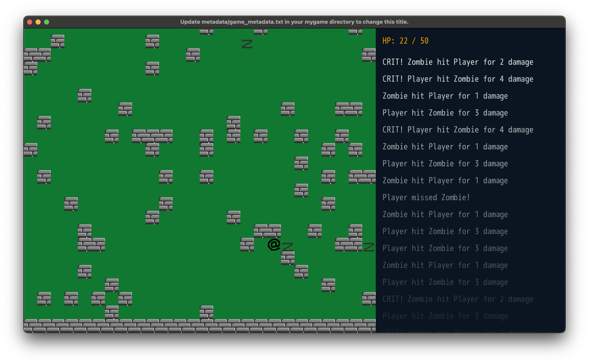

## DragonRuby Object Oriented, Sprite-based Roguelike Tutorial - Work In Progress
This is a set of tutorials to create a top-down 'roguelike'

[DragonRuby Object Oriented, Sprite-based Roguelike Tutorial](./roguelike_oo/README.md)

