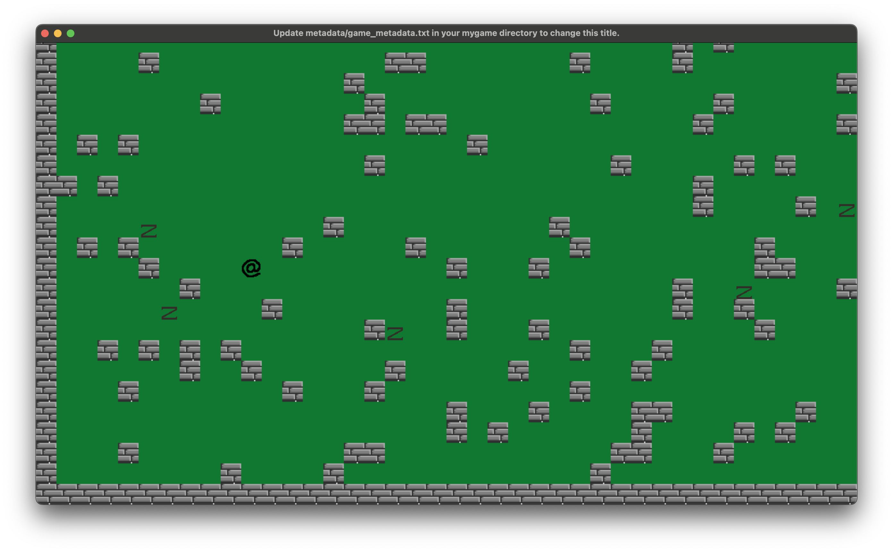

## Introduction

This is the fifth part of a series of tutorials building a top-down 'Roguelike' game. In the previous installments we created a basic framework for our classes, controllers, entities, etc, and got some 'Static Entities' in the form of map tiles drawn on the screen, and got our player entity rendered and moving around the screen, making the map/camera follow the player, and enabling tile-based collisions with the map.

I recommend you familiarise yourself with the previous parts, and we'll be using the 'final code' from the previous tutorial as our starting point here.

Next up we're going to add more entities, in the form of enemies.

## A wild <Enemy> Appears!
Create a new file at `/app/entities/enemy.rb`, which will serve as our core `Enemy` class that all enemy types will inherit from. Populate the file with:
```ruby
# /ascii/app/entities/enemy.rb
module Entities
  class Enemy < MobileEntity
  end
end

```

And create our first enemy at `/app/entities/zombie.rb`, and add this code:
```ruby
# /ascii/app/entities/zombie.rb
module Entities
  class Zombie < Enemy
    def initialize(opts = {})
      super
      @path = 'app/sprites/zombie.png'
    end
  end
end
```

Remember as always to include those in `main.rb`:
```ruby
# /ascii/app/main.rb
require 'app/entities/enemy.rb'
require 'app/entities/zombie.rb'
```

Before we go creating a pile of enemies, I think an `EnemyController` would be a good idea. This can be responsible for spawning enemies, looping through them to execute movements, removing dead enemies, etc. So go ahead and create a file at `app/controllers/enemy_controller.rb`, and put this placeholder code in for now:
```ruby
# /ascii/app/controllers/enemy_controller.rb
module Controllers
  class EnemyController
    def self.tick(args)
    end
  end
end
```

And include it in `main.rb`:
```ruby
# /ascii/app/main.rb
require 'app/controllers/enemy_controller.rb'
```
Next we want to make it spawn some enemies. So let's add a `spawn_enemies` and `spawn_enemy` method:
```ruby
# /ascii/app/controllers/enemy_controller.rb
def self.spawn_enemies(state)
  state.enemies ||= []
  30.times do
    tile_x = (::Controllers::MapController::MAP_WIDTH * rand).floor
    tile_y = (::Controllers::MapController::MAP_HEIGHT * rand).floor
    spawn_enemy(
      state,
      tile_x,
      tile_y,
      ::Entities::Zombie
    )
  end
end

def self.spawn_enemy(state, tile_x, tile_y, enemy_type)
  state.enemies << enemy_type.spawn(
    tile_x,
    tile_y
  )
end
```
The `spawn_enemies` makes sure the `state.enemies` array is initialized, then just loops 30 times, each time creating a random `tile_x`/`tile_y` somewhere on the map, and passes those to the `spawn_enemy` method which creates a Zombie, and shifts it into the `state.enemies` array.

To get the enemies showing up, go over to the `GameController`, and in `reset` add:
```ruby
# /ascii/app/controllers/game_controller.rb#reset
::Controllers::EnemyController.spawn_enemies(state)
```
And change the contends of `render` to:
```ruby
# /ascii/app/controllers/game_controller.rb
def self.render(state, sprites, labels)
  sprites << state.map.tiles
  sprites << state.enemies
  sprites << state.player
end
```
Run the game and you should see your Zombies showing up on the map (it's random, so try a couple of times if you don't see anything - and make sure you've copied the `zombie.png` from the examples folder into `app/sprites`).



## Spawning Safely
At the moment, players, enemies, etc can spawn anywhere, even on top of a wall piece. So we want to check whether a tile is `blocked` before spawning.

In `MobileEntity`, let's replace the `spawn` method with a `spawn_near` method, and pass the `state` to it. It will _try_ to spawn on the exact spot, but if that fails, we'll gradually increase the radius we're searching in and sample a few spots, until we find a space nearby to spawn.
```ruby
# /ascii/app/entities/mobile_entity.rb
def self.spawn_near(state, spawn_x, spawn_y)
  radius = 1
  attempt = 0
  tile = state.map.tiles[spawn_x][spawn_y]
  while tile.nil? || tile.blocking?
    spawn_x = (spawn_x - radius..spawn_x + radius).to_a.sample
    spawn_y = (spawn_y - radius..spawn_y + radius).to_a.sample
    tile = state.map.tiles[spawn_x][spawn_y]
    attempt += 1
    next unless attempt >= radius * 8

    radius += 1
    attempt = 0
  end
  new(
    map_x: spawn_x * SPRITE_WIDTH,
    map_y: spawn_y * SPRITE_HEIGHT
  )
end
```

Update the `GameController` to call `spawn_near` and pass the state:
```ruby
# /ascii/app/controllers/game_controller.rb#reset
state.player = ::Entities::Player.spawn_near(state, 10, 11)
```

And the EnemyController `spawn_enemy` method:
```ruby
# /ascii/app/controllers/EnemyController.rb
def self.spawn_enemy(state, tile_x, tile_y, enemy_type)
  state.enemies << enemy_type.spawn_near(
    state,
    tile_x,
    tile_y
  )
end
```

## Shamble?
Zombies are neat, but they're a bit _static_ like this, so lets get them moving. We'll get them to `patrol` shortly, which will just move the zombies around in random directions when the player takes a turn. First, though, we need a way to track if the player has actually moved this `tick`.

Within `player.rb`, at the top of the class definition, add an `attr_reader` called `took_action`:
```ruby
# /ascii/app/entities/player.rb
module Entities
  class Player < MobileEntity
    attr_reader :took_action
    # ...etc
```

and in the player's tick, set it to false at the start of the tick, and set it to true in our `attempt_move` block:
```ruby
# /ascii/app/entities/player.rb
def tick(args)
  @took_action = false
  # ... etc

  attempt_move(args, target_x, target_y) do
    ::Controllers::MapController.tick(args)
    @took_action = true
  end
end
```

In the `GameController`'s `tick` method, add a conditional call to the enemy controller's tick:
```ruby
# /ascii/app/controllers/game_controller.rb#tick
::Controllers::EnemyController.tick(args)
```

And change the `EnemyController`'s tick to this:
```ruby
# /ascii/app/controllers/enemy_controller.rb
def self.tick(args)
  return unless args.state.player.took_action

  enemies = args.state.enemies
  enemies.each { |enemy| enemy.patrol(state) }
end
```

And let's add base `patrol` and `tick` methods to the core `Enemy` class:
```ruby
# /ascii/app/entities/enemy.rb
def tick(args)
  patrol(args)
  @x = map_x - args.state.map.x
  @y = map_y - args.state.map.y
end

def patrol(args)
end
```

As a basic 'patrolling' behaviour, we want them to choose a random direction to move in, and just shuffle that direction on their turn, using the same `attempt_move` method we used for our player (so they are subject to the same tile-based collisions the human player is):

```ruby
# /ascii/app/entities/enemy.rb
def patrol(args)
  direction = [:up, :down, :left, :right].sample
  case direction
  when :up
    attempt_move(args, map_x, map_y + ::Controllers::MapController::TILE_HEIGHT)
  when :down
    attempt_move(args, map_x, map_y - ::Controllers::MapController::TILE_HEIGHT)
  when :left
    attempt_move(args, map_x - ::Controllers::MapController::TILE_WIDTH, tile_y)
  when :right
    attempt_move(args, map_x + ::Controllers::MapController::TILE_WIDTH, tile_y)
  else
  end
end
```

Continue in [Part 6](../06/tutorial.md)
