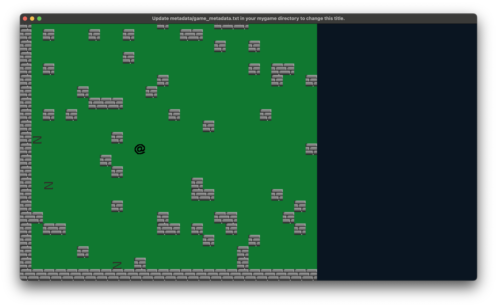

## Introduction

This is the seventh part of a series of tutorials building a top-down 'Roguelike' game. In the previous installments we created a basic framework for our classes, controllers, entities, etc, and got some 'Static Entities' in the form of map tiles drawn on the screen, and got our player entity rendered and moving around the screen, making the map/camera follow the player, and enabling tile-based collisions with the map. We also added our first enemies, and gave them a basic random movement/patrol behaviour and a 'seek player' behaviour, as well as introducing the concept of entities 'occupying' a tile, preventing other entities moving into them, to form our basic entity-to-entity collision.

I recommend you familiarise yourself with the previous parts, and we'll be using the 'final code' from the previous tutorial as our starting point here.

Next up we're going to take a bit of a break from extending our entities to lay out the screen using Render Targets.

## First Render Target

As it stands our game uses the entire screen to render the map, and the characters moving around on it, but ultimately we want to display other things on the screen. You might want to split the screen vertically like Caves of Qud, to have a 'map' area on the left and a 'stats/lore/log' area on the right. Or like ADOM have the map area taking up most of the upper few rows used for logging/text output of events, the lower few rows used for showing stats, with the remaining middle portion used for the map/play area.

I'm going to go for a left/right split, but first let's create our first in-game render target.

As it stands, our primary rendering `Controllers` (`GameController` and `TitleController`), expect `state` passed into their `render` methods. As we're about to start using render targets, we need the `args` in here. So in `Game` change the `active_controller.render...` call to:
```ruby
# /ascii/app/main.rb
active_controller.render(args, sprites, labels)
```
The `TitleController` doesn't do anything with the `state` that's passed, so updating is as simple as changing the method to:
```ruby
# /ascii/app/controllers/title_controller.rb
def self.render(args, sprites, labels)
  # ...etc
end
```
The `GameController` pushes sprites and labels onto the state, so it needs a _little_ more work, but still not a lot:

```ruby
# /ascii/app/controllers/game_controller.rb
def self.render(args, sprites, labels)
  sprites << args.state.map.tiles
  sprites << args.state.enemies
  sprites << args.state.player
end
```

Now we're ready to refactor that render method to use a render target:
```ruby
# /ascii/app/controllers/game_controller.rb
def self.render(args, sprites, labels)
  render_play_area(args)
  sprites << {x: 0, y: 0, w: 1280, h: 720, path: :play_area}
  sprites << args.state.enemies
  sprites << args.state.player
end

def self.render_play_area(args)
  args.render_target(:play_area).sprites << args.state.map.tiles
end
```
Instead of moving the tiles sprites into `args.sprites`, we move them into a render target via `args.render_target(:play_area)`. That `render_target` is basically just a 'dynamic sprite' that we're creating on the fly, so in the last line we shift the `play_area` into the `sprites` array.


## Second Render Target

We want to do the same with the player and enemies with an `entities` render target.
```ruby
# /ascii/app/controllers/game_controller.rb
def self.render(args, sprites, labels)
  render_play_area(args)
  render_entities(args)
  sprites << {x: 0, y: 0, w: 1280, h: 720, path: :play_area}
  sprites << {x: 0, y: 0, w: 1280, h: 720, path: :entities}
end

def self.render_entities(args)
  args.render_target(:entities).sprites << args.state.enemies
  args.render_target(:entities).sprites << args.state.player
end
```

Run the code now, and you should see nothing different to how it was previously.

## Resize the Play Area
We want it to take up, say, about 2/3 of the screen, leaving the other 1/3 for the side-panel.

Within `GameController` add these two constants:
```ruby
# /ascii/app/controllers/game_controller.rb
PLAY_AREA_WIDTH = 832
PLAY_AREA_HEIGHT = 720
```
And change the rendering of the of the play area like this:
```ruby
# /ascii/app/controllers/game_controller.rb
sprites << {x: 0, y: 0, w: PLAY_AREA_WIDTH, h: PLAY_AREA_HEIGHT, path: :play_area}
```
Hmmm. Looks a little squished, but it is at least taking up the correct amount of screen real estate.

To get things looking right, we need to dive into the extended (optional) parameters of a sprite. These are:
```ruby
[x, y, width, height, sprite_path, angle, alpha, red, green, blue, source_x, source_y, source_w, source_h, flip_vertically, flip_horizontally, angle_anchor_x, angle_anchor_y]
```
We can pass these as a hash, which is a bit more readable, and allows us to omit the optional parameters we don't need to set. :
```ruby
# /ascii/app/controllers/game_controller.rb
sprites << {x: 0, y: 0, w: PLAY_AREA_WIDTH, h: PLAY_AREA_HEIGHT, source_x: 0, source_y: 0, source_w: PLAY_AREA_WIDTH, source_h: PLAY_AREA_HEIGHT, path: :play_area}
```

This is looking a bit better, but we can walk off the screen, which is far from ideal. This is our map scrolling code, which is using the hard-coded values of 1280 and 720 for width/height of the screen.

In the MapController change the `max_x` and `max_y` as follows:
```ruby
# /ascii/app/controllers/map_controller.rb
def self.max_x
  MAP_WIDTH * TILE_WIDTH - ::Controllers::GameController::PLAY_AREA_WIDTH
end

def self.max_y
  MAP_HEIGHT * TILE_HEIGHT - ::Controllers::GameController::PLAY_AREA_HEIGHT
end
```

And we need to replace the hard-coded 1280/720 values in the `MapController`'s `tick` method with these `PLAY_AREA_WIDTH` and `PLAY_AREA_HEIGHT` constants:
```ruby
# /ascii/app/controllers/map_controller.rb
def self.tick(args)
  player = args.state.player
  map = args.state.map
  player_x_offset = player.map_x - map.x
  player_y_offset = player.map_y - map.y
  if player_x_offset < MOVEMENT_ZONE_BUFFER_X
    map.x = [min_x, map.x - TILE_WIDTH].max
  elsif player_x_offset > (::Controllers::GameController::PLAY_AREA_WIDTH - MOVEMENT_ZONE_BUFFER_X)
    map.x = [map.x + TILE_WIDTH, max_x].min
  end
  if player_y_offset < MOVEMENT_ZONE_BUFFER_Y
    map.y = [min_y, map.y - TILE_HEIGHT].max
  elsif player_y_offset > (::Controllers::GameController::PLAY_AREA_HEIGHT - MOVEMENT_ZONE_BUFFER_Y)
    map.y = [map.y + TILE_HEIGHT, max_y].min
  end

  args.state.map.tiles.flatten.each { |tile| tile.tick(args) }
end
```

## The Third Render Target
Let's cover the void area to the right with a beautiful blackish box, by adding another render target.

Set the size and width of this right column via two more constants in `GameController`:
```ruby
# /ascii/app/controllers/game_controller.rb
TEXT_AREA_WIDTH = 1280 - PLAY_AREA_WIDTH
TEXT_AREA_HEIGHT = 720
```
Add a new `render_text_area` method:
```ruby
def self.render_text_area(args)
  args.render_target(:text_area).solids << {x: 0, y: 0, w: TEXT_AREA_WIDTH, h: TEXT_AREA_HEIGHT, r: 10, g: 21, b: 33}
end
```
> For `solids` we're setting x, y, width, height, r, g, b

And add a call to `render_text_area`, then shift it onto the `sprites` stack:
```ruby
def self.render(args, sprites, labels)
  render_play_area(args)
  render_entities(args)
  render_text_area(args)
  sprites << {x: 0, y: 0, w: PLAY_AREA_WIDTH, h: PLAY_AREA_HEIGHT, source_x: 0, source_y: 0, source_w: PLAY_AREA_WIDTH, source_h: PLAY_AREA_HEIGHT, path: :play_area}
  sprites << {x: 0, y: 0, w: PLAY_AREA_WIDTH, h: PLAY_AREA_HEIGHT, source_x: 0, source_y: 0, source_w: PLAY_AREA_WIDTH, source_h: PLAY_AREA_HEIGHT, path: :entities}
  sprites << {x: PLAY_AREA_WIDTH, y: 0, w: TEXT_AREA_WIDTH, h: TEXT_AREA_HEIGHT, source_x: 0, source_y: 0, source_w: TEXT_AREA_WIDTH, source_h: TEXT_AREA_HEIGHT, path: :text_area}
end
```



## Optimizing the Render Targets
The benefit of render targets is that they can be drawn once and then reused, rather than being redrawn every frame. This is particularly useful for static elements, like the map tiles, which don't change but use a large number of cycles to render (and the bigger the map, the more time required to render all those sprites).

Render Targets retain their last texture until they are next written to. This means that if we draw the map to the render target once, we can then just draw the render target to the screen every frame, rather than redrawing each of the map tiles every frame.

Update the GameController method `reset` to set two flags on the state, `redraw_play_area` and `redraw_text_area`:

```ruby
# /ascii/app/controllers/game_controller.rb
def self.reset(state)
  ::Controllers::MapController.load_map(state)
  state.player = ::Entities::Player.spawn_near(state, 10, 11)
  ::Controllers::EnemyController.spawn_enemies(state)
  state.redraw_play_area = true
  state.redraw_entities = true
  state.redraw_text_area = true
end
```

Update the `render` method to check these flags and only redraw the render targets if they are set to true:

```ruby
def self.render(args, sprites, labels)
  render_play_area(args) if args.state.redraw_play_area
  render_entities(args) if args.state.redraw_entities
  render_text_area(args) if args.state.redraw_text_area
  sprites << {x: 0, y: 0, w: PLAY_AREA_WIDTH, h: PLAY_AREA_HEIGHT, source_x: 0, source_y: 0, source_w: PLAY_AREA_WIDTH, source_h: PLAY_AREA_HEIGHT, path: :play_area}
  sprites << {x: 0, y: 0, w: PLAY_AREA_WIDTH, h: PLAY_AREA_HEIGHT, source_x: 0, source_y: 0, source_w: PLAY_AREA_WIDTH, source_h: PLAY_AREA_HEIGHT, path: :entities}
  sprites << {x: PLAY_AREA_WIDTH, y: 0, w: TEXT_AREA_WIDTH, h: TEXT_AREA_HEIGHT, source_x: 0, source_y: 0, source_w: TEXT_AREA_WIDTH, source_h: TEXT_AREA_HEIGHT, path: :text_area}
end
```

Next, update the `MapController` to set these flags to false after the render targets have been drawn:

```ruby
def self.render_play_area(args)
  state.redraw_play_area = false
  args.render_target(:play_area).sprites << args.state.map.tiles
end

def self.render_entities(args)
  args.state.redraw_entities = false
  args.render_target(:entities).sprites << args.state.enemies
  args.render_target(:entities).sprites << args.state.player
end

def self.render_text_area(args)
  args.state.redraw_text_area = false
  args.render_target(:text_area).solids << {x: 0, y: 0, w: TEXT_AREA_WIDTH, h: TEXT_AREA_HEIGHT, r: 10, g: 21, b: 33}
end
```

Last thing needed is to redraw the entities in their new position after movement, and redraw the play area. This is done in the `tick` method of the `Player`:

```ruby
# /ascii/app/entities/player.rb
def tick(args)
  # etc
  attempt_move(args, target_x, target_y) do
    ::Controllers::MapController.tick(args)
    @took_action = true
    args.state.redraw_entities = true
    args.state.redraw_play_area = true
    update_tile(args)
  end
end
```

There is scope to be more clever about this. While we need to redraw the entities whenever something moves, we only need to redraw the play area if the player's movement causes the map to scroll. Feel free to experiment with this, but for now this is a good optimization.

Continue in [Part 8](../08/tutorial.md)
